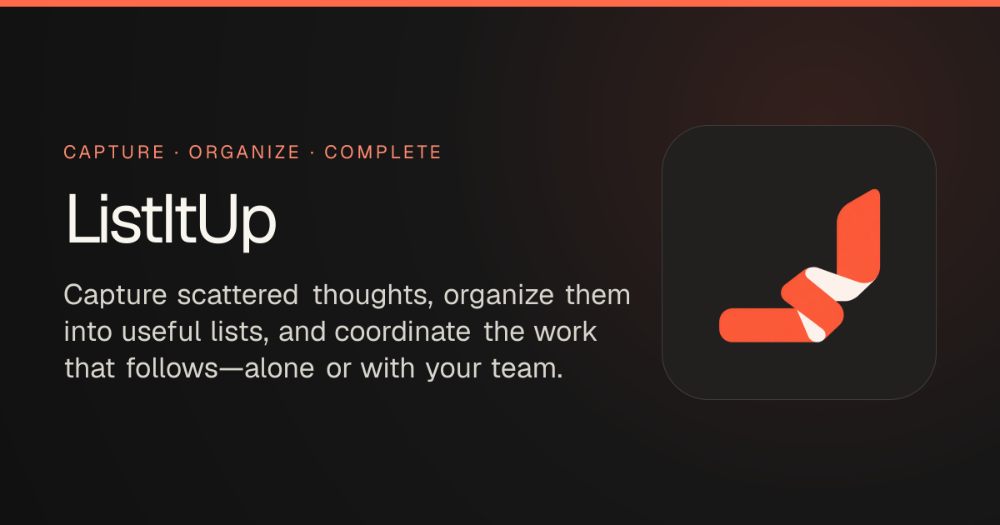
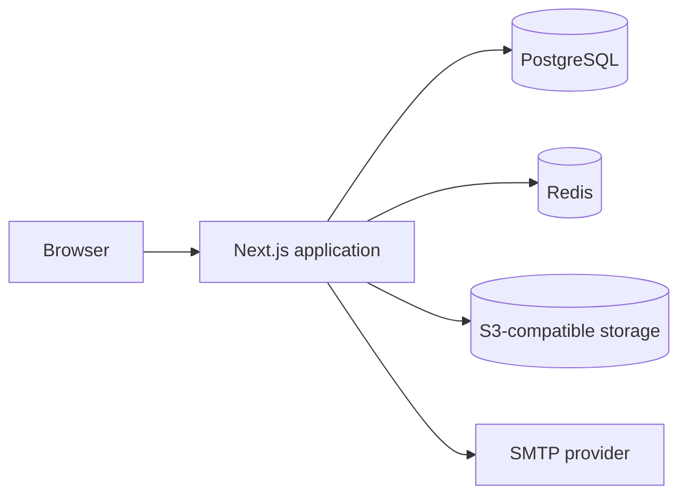

<div align="center">



<br />

[](#project-status)
[](LICENSE)
[](client/package.json)
[](client/package.json)
[](client/tsconfig.json)
[](#self-host-with-docker)

**A calm, practical workspace for turning scattered intentions into useful structure.**

[Product](#why-listitup) · [Capabilities](#capabilities) · [Quick start](#quick-start) · [Documentation](#documentation) · [Contributing](CONTRIBUTING.md)

</div>

> [!IMPORTANT]
> ListItUp is in active early development. The hosted database is currently offline, so the public URL is not a reliable demo yet. The source, product model, and local/self-hosted setup remain available here.

## Why ListItUp?

Most work-management tools begin with configuration. ListItUp begins with the thought you do not want to lose.

Capture it quickly. Give it structure when the structure becomes useful. Coordinate it with other people only when the work calls for it.

<table>
  <tr>
    <td width="33%" valign="top">
      <h3>01 / Capture</h3>
      Add an Item before deciding exactly where it belongs. Personal capture defaults to an Inbox List.
    </td>
    <td width="33%" valign="top">
      <h3>02 / Organize</h3>
      Turn loose Items into Lists and Sections. Add dates, priorities, labels, dependencies, or custom fields only when needed.
    </td>
    <td width="33%" valign="top">
      <h3>03 / Coordinate</h3>
      Assign work, share context, track blockers, and move between focused List, Board, Calendar, Timeline, Files, and Dashboard views.
    </td>
  </tr>
</table>

ListItUp deliberately avoids productivity theater. There are no streaks, artificial scores, or ceremony for ceremony's sake—just clear work, visible responsibility, and enough structure to keep moving.

## Capabilities

### Structure work your way

- Create Lists for tasks, ideas, products, notes, or decision candidates.
- Group Items into reorderable Sections and nest child Items to any depth.
- Switch between List, Board, Calendar, Timeline, Files, and Dashboard views.
- Add priorities, due dates, labels, custom fields, dependencies, attachments, and Notes.
- Archive and restore Lists or individual Items without losing history.

### Work alone or together

- Keep private work in an automatically provisioned Personal Space.
- Collaborate through shared Workspaces with Owner, Admin, Member, and Viewer roles.
- Set List-level Lead, Member, Viewer, and Guest access.
- Use **My Tasks** to see assigned Items across every Workspace without creating duplicates.
- Track Updates, mentions, notification preferences, and personal Notes.

### Stay operational

- Start with a ready-to-explore Demo Workspace after verified sign-in.
- Use quick-add syntax to capture dates, assignees, labels, and destination Lists.
- Review completion, overdue work, state breakdowns, and progress from Dashboard views.
- Keep attachment data in private S3-compatible object storage.
- Protect accounts with password, magic-link, recovery, and TOTP two-factor flows.

## Project status

The codebase already contains the product's core vertical slices. Production hardening and deployment infrastructure are still in progress.

| Area                                                        | Status                   |
| ----------------------------------------------------------- | ------------------------ |
| Authentication, verification, recovery, and 2FA             | Available in code        |
| Personal Space, Demo Workspace, and shared Workspaces       | Available in code        |
| List, Section, and Item lifecycle                           | Available in code        |
| List, Board, Calendar, Timeline, Files, and Dashboard views | Available in code        |
| My Tasks, Home, Profile, and Updates                        | Available in code        |
| Attachments, Notes, Labels, Custom Fields, and Dependencies | Available in code        |
| Expanded analytics and comparative reporting                | In progress              |
| List Channels and Direct Messages                           | Planned for v2           |
| Hosted production infrastructure                            | Offline / being prepared |

The issue tracker is the live work queue: [github.com/codesuke/ListItUp/issues](https://github.com/codesuke/ListItUp/issues).

## Tech stack

| Layer          | Technology                                                     |
| -------------- | -------------------------------------------------------------- |
| Application    | Next.js 16 App Router, React 19, TypeScript                    |
| Interface      | Tailwind CSS, Base UI/shadcn primitives, Lucide, Framer Motion |
| Data           | PostgreSQL, Prisma 7, `@prisma/adapter-pg`                     |
| Authentication | Better Auth, TOTP 2FA, Redis-backed rate limits                |
| Files          | Private S3-compatible storage; MinIO for self-hosting          |
| Email          | SMTP through Nodemailer                                        |
| Delivery       | Docker, Docker Compose, or a platform such as Dokploy          |



Everything under [`client/`](client/) is one deployable application. Server Components, Server Actions, Route Handlers, authentication, and persistence all live inside that Next.js boundary.

## Quick start

### Prerequisites

- Node.js 24+
- pnpm 10.x through Corepack
- PostgreSQL 16+
- Redis
- S3-compatible object storage such as MinIO
- An SMTP account for verification and recovery email

### Local development

```bash
git clone https://github.com/codesuke/ListItUp.git
cd ListItUp/client

corepack enable
pnpm install
cp .env.example .env
```

Fill in the required values in `client/.env`, then prepare the database and start the app:

```bash
pnpm run prisma:migrate
pnpm dev
```

Open [http://localhost:3000](http://localhost:3000).

> [!TIP]
> The app fails early when required infrastructure is missing. If authentication cannot start, check `DATABASE_URL`, `REDIS_URL`, and `BETTER_AUTH_URL` first. `BETTER_AUTH_URL` must include `http://` or `https://`.

### Self-host with Docker

The Compose stack supplies the application, PostgreSQL, migrations, and MinIO:

```bash
git clone https://github.com/codesuke/ListItUp.git
cd ListItUp
cp .env.example .env

# Replace every placeholder secret and configure SMTP first.
docker compose up -d
docker compose ps
```

The application is exposed at [http://localhost:3000](http://localhost:3000). Follow logs with:

```bash
docker compose logs -f app
```

> [!NOTE]
> Redis is currently external to the Compose file. Add a reachable `REDIS_URL` to `.env` before starting the application.

### Platform deployment

[`client/Dockerfile`](client/Dockerfile) produces the standalone production image used by platforms such as Dokploy. Set the build context to `client/`, provision PostgreSQL, Redis, object storage, and SMTP, then copy the required values from [`client/.env.example`](client/.env.example).

The container applies committed Prisma migrations before starting the Next.js server. It exits instead of serving against an outdated schema when migration fails.

<details>
<summary><strong>Required environment groups</strong></summary>

| Group          | Variables                                                                                                                                       |
| -------------- | ----------------------------------------------------------------------------------------------------------------------------------------------- |
| Database       | `DATABASE_URL`                                                                                                                                  |
| Authentication | `BETTER_AUTH_SECRET`, `BETTER_AUTH_URL`, `REDIS_URL`                                                                                            |
| Email          | `SMTP_HOST`, `SMTP_PORT`, `SMTP_SECURE`, `SMTP_USER`, `SMTP_PASSWORD`, `MAIL_FROM_NAME`, `MAIL_FROM_EMAIL`                                      |
| Attachments    | `OBJECT_STORAGE_ENDPOINT`, `OBJECT_STORAGE_REGION`, `OBJECT_STORAGE_BUCKET`, `OBJECT_STORAGE_ACCESS_KEY_ID`, `OBJECT_STORAGE_SECRET_ACCESS_KEY` |
| Operations     | `DISCORD_SECURITY_WEBHOOK_URL`, `SECURITY_CLEANUP_SCHEDULER_SECRET`                                                                             |

Use [`.env.example`](.env.example) for Compose or [`client/.env.example`](client/.env.example) for local/platform deployments. Never commit real secrets.

</details>

## Development checks

Quality checks are intentionally local-only during the current stage of development. There are no GitHub Actions, Dependabot jobs, or Git hooks configured.

Run the checks you need from `client/`:

```bash
pnpm lint
pnpm typecheck
pnpm build
```

The full behavior suite requires disposable PostgreSQL, Redis, and Mailpit services:

```bash
docker compose -f docker-compose.test.yml up -d
cd client

set -a
. .env.test.example
set +a

pnpm exec prisma migrate deploy
pnpm test
```

Stop the disposable stack when finished:

```bash
docker compose -f docker-compose.test.yml down
```

## Repository map

```text
ListItUp/
├── client/                  Next.js application
│   ├── app/                 routes, layouts, metadata, and server actions
│   ├── components/          shared interface components
│   ├── lib/                 domain and infrastructure modules
│   ├── prisma/              schema and committed migrations
│   └── public/              static assets and brand files
├── docs/
│   ├── ADR/                 durable architecture decisions
│   ├── QnA/                 resolved product discussions
│   ├── Research/            supporting product research
│   └── Specs-Planned/       planned product work
├── Architecture.md          physical architecture and conventions
├── CONTEXT.md               canonical product vocabulary
├── Brand.md                 positioning, voice, and personality
└── DESIGN.md                interface design contract
```

## Documentation

| Document                                                 | Use it for                                                 |
| -------------------------------------------------------- | ---------------------------------------------------------- |
| [`CONTEXT.md`](CONTEXT.md)                               | Canonical product terms and definitions                    |
| [`Brand.md`](Brand.md)                                   | Positioning, promise, voice, and visual direction          |
| [`DESIGN.md`](DESIGN.md)                                 | UI composition, tokens, typography, motion, and guardrails |
| [`Architecture.md`](Architecture.md)                     | Repository layout, stack, testing, and code placement      |
| [`docs/Frontend-Overview.md`](docs/Frontend-Overview.md) | Frontend scope and implementation sequence                 |
| [`docs/ADR/`](docs/ADR/)                                 | Durable technical and product decisions                    |
| [`docs/Specs-Planned/`](docs/Specs-Planned/)             | Planned feature specifications                             |
| [`docs/licensing.md`](docs/licensing.md)                 | The MIT license explained in plain English                 |

## Contributing

Bug reports, documentation improvements, design feedback, and code contributions are welcome. Start with [CONTRIBUTING.md](CONTRIBUTING.md), then pick an issue labeled [`ready-for-agent`](https://github.com/codesuke/ListItUp/labels/ready-for-agent) or [`ready-for-human`](https://github.com/codesuke/ListItUp/labels/ready-for-human).

Please read the [Code of Conduct](CODE_OF_CONDUCT.md) before participating. Report security vulnerabilities privately through [SECURITY.md](SECURITY.md), not a public issue.

## License

ListItUp is open source under the [MIT License](LICENSE). You may use, modify, self-host, and redistribute it—including commercially—provided you retain the license and copyright notice.

<div align="center">

Built by [VirtuNode](https://github.com/VirtuNode-dev) · [Open an issue](https://github.com/codesuke/ListItUp/issues) · [Read the license guide](docs/licensing.md)

</div>
